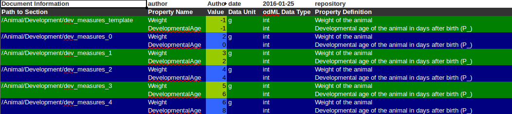
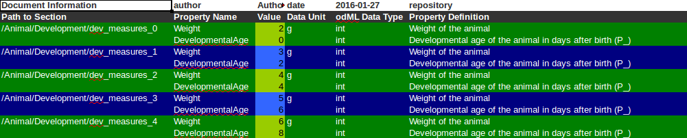

odMLtables Tutorial
===================

:Authors:
	Jana Pick and Lyuba Zehl
:Release:
	0.1
:License:
	Creative Commons Attribution-ShareAlike 4.0 International
	`License <http://creativecommons.org/licenses/by-sa/4.0/>`_

In general there are two different kinds of tables you can create yet: a table with an overview of your whole odML or a table comparing different sections of the odML due to their properties. How they exactly look like will be shown later. But you should know, that only the first table can be converted back to an odML-file.

odML-table
***********

This table is basically just a flat version of the odML-file. Every row of the table represents a value of the odML (as you will see later, that does not mean you have to print every value) and gives all available information about this value. Those are:

* **Path** The Path to the Section next to the Value. Every Value belongs to exactly one Property, and every Property to exactly one Section. So, by giving the Path to the Section you automatically get the Path to the Value by adding the Name of the Property and the Value. This must be in the table, if you want to convert it back to an odML-file, otherwise it will be impossible to recreate the hierarchic structure of the odML.
* **SectionName** The Name of the Section next to the Value. This one is optional, as the name of the Section is already given in the Path.
* **SectionDefinition** The Definition of the Section next to the Value. This is an optional attribute in odML, so it is also optional in the table.
* **SectionType** The type of the Section.
* **PropertyName** The Name of the Property the Value belongs to. This one is not optional, if you want to convert the table back to an odML.
* **PropertyDefinition** The Definition of the Property.
* **Value** The metadata-Value itself. A Property without Values cannot exist, so this has to be in the table to create an odML from it.
* **ValueDefinition** The definition of the Value (optional).
* **DataUnit** The Unit of the Value (optional).
* **DataUncertainty** The uncertainty of the Value (optional).
* **odmlDatatype** The odML data Type of the Value. This is important, because it might be different from the datatype in Python or Excel. This one must be given in the table if you want to convert it back to odML.

Those are many options, and in most cases you dont need all those information. The default columns of an odML-Table are 'Path', 'Property Name', 'Value' and 'odML Data Type', as those are the information needed to create an odML from the information in the table.

csv
+++

As already mentioned in the introduction there are different formats you can save your files to; at the moment those are csv or xls. Since xls provides much more possibilities concerning the appearance of the table we will start with the easier csv-format.

create the first table
----------------------

To create a csv table from an odML-file you have to import the class :class:`odml_csv_table.OdmlCsvTable`::

    from odml_csv_table import OdmlCsvTable

    myFirstTable = OdmlCsvTable()

Then you can load your odML-file::

    myFirstTable.load_from_file('testfile.odml')

Now you can already write it to a csv-file by using the following command::

    myFirstTable.write2file('testtable.csv')

You will get a table with the four columns; 'Path', 'Property Name', 'Value' and 'odML Data Type'.

load the odML
-------------

You can not only, as shown in the example above, load the odML from an odML-file. There are several other possibilities:

1. load from an :class:`odml.Document` (class of the odML-Python-library)::

    import odml

    doc = odml.Document()
    # now append some sections, properties and values to the document

    myTable = OdmlCsvTable()
    myTable.load_from_odmldoc(doc)

2. load from a python function that creates an :class:`odml.Document`::

    import odml

    def function1():
        doc = odml.Document()
        # now append some sections, properties and values to the document

        return doc

    myTable = odmlCsvTable()
    myTable.load_from_function(function1)

3. load from a table (this option will be explained later)

changing the header
-------------------

Next step is to change the header in favor of your plans for the table. You can choose, which of the possible columns given above will be in the table and also what their name is.

.. warning::
   If you miss out one of the columns 'Path', 'Property Name', 'Value' and 'odML Data Type' in your table, it cannot be converted back to an odML-file. Also, if you change the names of the columns you will have to use the same settings to convert it back.

By using the function :func:`odml_table.OdmlTable.change_header_titles` you can choose an own title for every column::

    myFirstTable.change_header_titles(Path='my path',
                                      PropertyName='my property',
                                      Value='my value',
                                      odmlDatatype='my datatype')

The table should now look exactly as the old one, with the only difference that the names of the columns have changed. If you want to print some more information, you can adjust this by using the function :func:`odml_table.OdmlTable.change_header`::

    myFirstTable.change_header(Path=1,
                               SectionName=2,
                               SectionDefinition=3,
                               PropertyName=4,
                               Value=5)

As you can see, in this function you can not only decide the columns but also their order, by giving them numbers from 1 on. If, for some reason, you want to have an empty column inside your table, you will have to set the option ``odml_table.OdmlTable.allow_empty_columns`` to True ::

    myFirstTable.allow_empty_columns = True

After this command, a code as the following should work fine::

    myFirstTable.change_header(Path=1,
                               PropertyName=3,
                               Value=4,
                               SectionDefinition=7,
                               DataUncertainty=8)

avoiding unnessaccery entries
-----------------------------

You might already have notized, that not every cell of the tables is filled. To make a table better humanreadable, some information about the Section (Path, SectionName and SectionDefinition) or the Property (PropertyName, PropertyDefinition) wont be printed in the table if they dont change. To change this behaviour use the options ``showall_sections`` and ``showall_properties``::

    myFirstTable.showall_sections = True
    myFirstTable.showall_properties = True

Now everything should be there.

.. _XLS:

xls
+++

All those functions already shown for the csv-table also work with xls. But there are some additional features concerning the Style of cells. First you need import the modul and create a new table::

    from odml_xls_table import OdmlXlsTable
    myXlsTable = OdmlXlsTable()

choosing styles
---------------

There are some styles you can easily change in the table. First, there is the style of the header. You can choose the backcolor and fontcolor and the style of the font::

    myXlsTable.header_style.backcolor = 'blue'
    myXlsTable.header_style.fontcolor = ''
    myXlsTable.header_style.fontstyle = 'bold 1'

The same way you can adapt the styles ``first_style`` and ``second_style``. Those are the styles used for the normal rows of the table. For a better overview there are those two styles, which are used alternating (for more information see section about `changing pattern`_.

You can find a table with all possible colors and their names :download:`here <colors.xls>`.

marking columns
---------------

Sometimes there might be columns you want to lay a special focus on. So, to mark columns that they differ from the other, there is the option ``mark_columns``::

    myXlsTable.mark_columns('Path', 'Value')

Those marked columns will have a different style, which is determined by the attributes ``first_marked_style`` and ``second_marked_style`` (those can also be changed).

changing pattern
----------------

By default the two different styles for the rows will alternate when a new section starts. But you can also change this behavior to a new property or a new value and, if you dont want different colors at all, just turn it off. This works by setting ``changing_point`` to either 'sections', 'properties', 'values' or None::

    myXlsTable.changing_point = 'values'

Also, for a better distinctness between the columns , you can choose a 'chessfield'- pattern, so the styles will switch with every row.::

    myXlsTable.pattern = 'chessfield'

table to compare sections
*************************

It might happen, that you have several sections with similar properties, for example TODO: example . To create a table, in which you can easily compare different sections of an odml, you can use this classes.

csv
+++

The easiest format here is, again, csv. So for the beginning, here is how you create a table to compare sections due to their properties in csv.

the beginning
----------------

to create a csv-file with the table, import the class::

    from compare_section_csv_table import CompareSectionCsvTable
    myCompareTable = CompareSectionCsvTable()

Now you can load the table::

    myCompareTable.load_from_file('somefile.odml')

choosing sections
-----------------

Next you have to decide, which sections of the table you want to compare. You can either just choose all sections out of a list of sectionnames or you can select all sections with a specific beginning::

    myCompareTable.choose_sections('s1', 's2', 's3')

    # or

    myCompareTable.choose_sections_startwith('s')

You can already write this table to a file::

    myCompareTable.write2file('compare.csv')

switch the table
----------------

Now the section names should be in the header and the property names in the first column. This can be inverted by using the command ``switch``::

    myCompareTable.switch = True

This time the property names should be in the header and the names of the sections in the first column. For example if you have many sections to compare you might get a better overview by switching the table this way.

include all
-----------

If the sections you compare dont have exactly the same structure there might be properties appearing in one section but not in another. If you only want to compare those properties that are present in all of your chosen sections, use the option include_all::

    myCompareTable.include_all = False

xls
+++

In this part you will find the additional options for an xls-table.

first table
-----------

to create a new table use the command::

    from compare_section_xls_table import CompareSectionXlsTable()
    xlsCompareTable = CompareSectionXlsTable()

changing styles
---------------

there are different styles you can adjust in this table:

1. **headerstyle** The style used for the captions of rows and columns
2. **first_style** The style used for the values inside the table
3. **second_style** The second style used for the values inside the table
4. **missing_value_style** If ``include_all`` is True, this style will be used if a property doesnt exist in the section, so they distinguish from properties with empty values

You can, as already shown for the odml-table (`choosing styles`_), adjust backcolor, fontcolor and fontstyle for each of the styles.

practical examples
******************

In these three short examples you will learn how to:

1. Generate a template odml starting from a table, which will then be used to
2. Manually enrich the odml via a tabular representation like it could be done in a daily workflow and finally how to
3. Reduce an odml, such that it can be used for a laboratory notebook or specific overviews

.. _example1:

example 1: Generating a template odml
+++++++++++++++++++++++++++++++++++++
In this example you will learn how to generate an odml template file starting from an empty xls file. First you need to create an empty xls file 'Example1.xls' and fill the first row with the header titles. In principle only four header title are necessary to generate an odml from an xls table ('Path to Section', 'Property Name', 'Value' and 'odML Data Type'). Here we use two additional header titles ('Data Unit', 'Property Definition') as this information is important for the later understanding of the metadata structure. The table should now look like this:

|

.. csv-table::
   :file: csv/example1-1.csv
   :widths: 10,10,10,10,10,20

|

Next, you need to decide on a structure of your odml. Here, we are implementing only a small branch of an odml, which is describing an animal, its attributes and surgery. First of all, we are choosing properties we want to cover in the odml to describe

**The animal**

* **AnimalID** ID of the animal used for this experiment
* **Species** Species of the animal
* **Sex** Sex of the animal
* **Birthdate** Birthdate of the animal
* **Litter** ID of the litter
* **Seizures** Occurrence of seizures (observed / not observed)

**The surgery**

* **Surgeon** Name of the surgeon
* **Date** Date of surgery conduction (yyyy-mm-dd)
* **Weight** Weight of the animal (g)
* **Quality** Quality of the surgery (good / ok / bad)
* **Anesthetic** Type of anaesthetic
* **Painkiller** Name of painkiller, if used
* **Link** URL or folder containing surgery protocol

By describing the meaning of the properties, we already also covered the property definition we need to provide. As the surgery is typically specific to the animal, we are going to use one main section for the animal ('/Animal') and a subsection for the description of the surgery ('/Animal/Surgery'). These are the 'Path to Section' values we need to provide in the xls table. In the next step we need to define the data types of the values we are going to put in the odml. For most of the values a string is the best option (AnimalID, Species, Sex, Litter, Seizures, Surgeon, Quality, Anaesthestic, Painkiller), however some properties need different datatypes:

* **Birthdate / Date** date
* **Weight** float, this can be an arbitrary non-integer number
* **Link** url, this basically a string, but with special formatting.

Finally we are also able to define units for the values we are going to enter in this odml. In this example a unit is only necessary for the weight value, as the interpretation of this value highly depends on the unit. We define the unit of the weight as gram (g).
If you now enter all the information discussed above in the xls table, this should look like below:

|

.. csv-table::
   :file: csv/example1-2.csv
   :widths: 10,10,10,10,10,20

|

For the conversion of the xls file to an odml template file, you need to generate an OdmlXlsTable object and load the your xls file::

    import odmltables.odml_xls_table as odxlstable
    # create OdmlXlsTable object
    xlstable = odxlstable.OdmlXlsTable()

    # loading the data
    xlstable.load_from_xls_table('Example1.xls')

Now you can save it directly as odml file::

    xlstable.write2odml('example1.odml')

If you now open the odml file in the browser or save it again as in the tabular format, you will see that also value have appeared for the properties. These values are default values defined in the odml-table OdmlDtypes class, which are automatically inserted into empty value cells to get a well defined odml. The default values can be customized via the OdmlDtypes class (:class:`odml_table.OdmlDtypes`).

This new odml file can now be used for multiple repetitions of the experiment and provides a standardized frame for recording metadata in this experiment.

example 2: Manual enrichment of odml
++++++++++++++++++++++++++++++++++++

In this example you are going to manually add data to an already existing odml document (see :ref:`example1`). In the best case, this odml document was already automatically enriched with digitally accessible values by custom, automatic enrichment routines. Then only few non-digitally available data need to be entered manually to complete the odml. However, in principle the manual enrichment method presented here can also be used to start from an empty template odml and manually enter all values of the odml.

First of all, we are going to start from the odml generated in :ref:`example1`. If you don't have the resulting file from :ref:`example1`, you can instead use :file:`odml_tables/examples/example1/example1-2.odml` or generate an already pre-enriched odml (:file:`odml_tables/examples/example2/example2-1.odml`) by running::

    'python example2.py'

To generate an OdmlTables object, load the odml and save it again as xls file::

    import odmltables.odml_xls_table as odml_xls_table

    # create OdmlXlsTable object
    xlstable = odml_xls_table.OdmlXlsTable()

    # loading data from odml
    xlstable.load_from_file(pre_enriched_file)

    # save in xls format
    xlstable.write2file('automatically_enriched.xls')

Now you need to manually enter the data you generated during the surgery into the xls file using your preferred spreadsheet software:

|

=============== ============== =====================================  ==============
Path to Section Property Name  Value                                  odML Data Type
=============== ============== =====================================  ==============
/Animal	        AnimalID       2A                                     string
\               Species        Meriones unguiculatus                  string
\               Sex            female                                 string
\               Birthdate      21-10-2015                             date
\               Litter         1A-01                                  string
\               Seizures       not observed                           string
/Animal/Surgery	Surgeon        Surgeon1	                              string
\               Date	       29-01-2016	                          date
\               Weight	       100	                                  float
\               Quality	       good	                                  string
\               Anaesthetic	   urethane	                              string
\               Painkiller	                                          string
\               Link	       ../../surgery/protocols/protocol1.pdf  url
=============== ============== =====================================  ==============

|

The completed xls file can then be saved as 'manually_enriched.xls' and converted back to the odml format via::

    import odmltables.odml_xls_table as odml_xls_table

    # create OdmlXlsTable object
    xlstable = odml_xls_table.OdmlXlsTable()

    # load data from manually enriched xls file
    xlstable.load_from_xls_table('manually_enriched.xls')

    # save data as odml document
    xlstable.write2odml('example2-2.odml')

The 'example2-2.odml' file is now complete and can used for long term metadata storage and easy and fast metadata access for further analyses.

example 3: Creating an overview sheet / Filtering
+++++++++++++++++++++++++++++++++++++++++++++++++

In this example you are going to create an overview xls table of containing only a selection of properties of the original xls document.
This feature can be used to create a summary table to be included in a laboratory notebook.

To apply the filter function we first need to generate a metadata collection. Here we are going to start from an xls representation of an odml, which you can generate by executing the example3.py script in the odmltables/example folder::

    'python example3.py'

This generates the file *example3.xls*, which should look like this:

.. figure:: screenshots/example3-1.png
    :scale: 50 %
    :alt: Example 3: Xls representation of the complete odml structure.

    Example 3: Xls representation of the complete odml structure.

This example structure contains only the branch of an odml describing the animal and its development. The previously known information about the animal are saved in properties directly attached to the '/Animal' section. To capture the developmental data measured a subsection '/Animal/Development' exists, which contains developmental properties only consisting of a single measurement value. In addition several 'dev_measures_x' subsections are attached to the 'Animal/Development' section, which each contain a set of values measured on one day. These sections are copies of the '/Animal/Development/dev_measures_template' section. Typically the template section is copied for each day of measurement and values are entered manually (eg. in this xls sheet).

For practical purposes it can be necessary to create an overview sheet containing only a subset of these developmental measures, eg. for printing them and adding them to the laboratory notebook. Here we are now focusing on the 'DevelopmentalAge' and 'Weight' properties.
To get an odmltables representation of the xls file we are generating an OdmlXlsTable object and loading the data from the xls file::

    import odmltables.odml_xls_table as odxlstable
    # create OdmlXlsTable object
    xlstable = odxlstable.OdmlXlsTable()

    # loading the data
    xlstable.load_from_xls_table('Example3.xls')

Now we are going to apply a filter, which only leaves the properties with name 'DevelopmentalAge' or 'Weight' in the table::

    xlstable.filter(PropertyName=['DevelopmentalAge','Weight'], comparison_func= lambda x,y: (x in y))

If we save it as 'Example3_Output.xls'::

    xlstable.write2file('Example3_Output.xls')

this looks as following:

    Example 3: Xls representation of the odml structure after first filtering.

However, the resulting table still contains the 'dev_measures_template' section and all its properties, which is not usefull in a printout for a laboratory notebook. To remove this, we apply a second filter::

    xlstable.filter(invert=True,Path='template', comparison_func=lambda x,y: x.endswith(y))

This operation only leaves properties in the table, whose parent section name does not end with 'template' and therefore removes the 'dev_measures_template' section and all its properties.

    Example 3: Xls representation of the odml structure after second filtering.

This filtered representation of the original xls file can also be further adapted in terms of the layout of the table (see XLS_) and finally printed or converted to pdf using a spreadsheet software.

