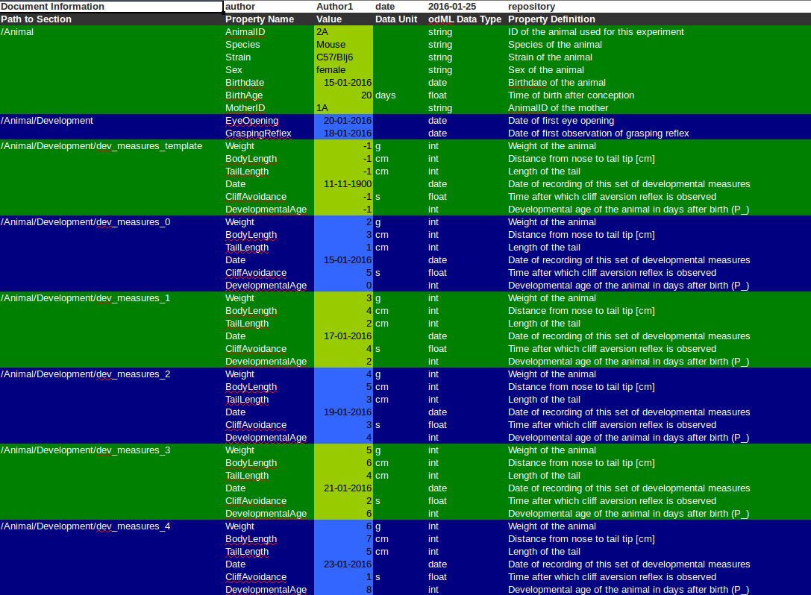
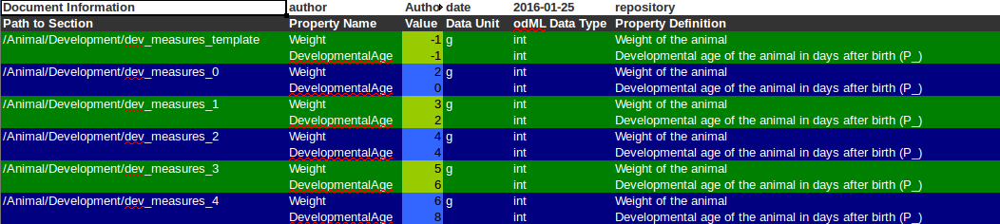
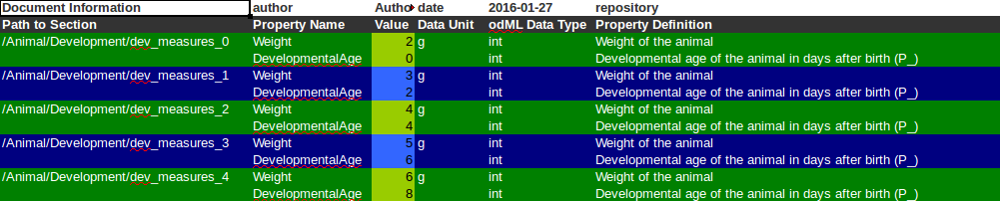

********
Tutorial
********

At its core, odMLtables is a tool to convert hierarchical representations of metadata stored in the odML format to flat, tabluar formats. While the former is ideal to store, group, and structure large metadata collections, the latter is easier to visualize for the human eye and may be edited using powerful spreadsheet software. In either case, the data are structured as property-value pairs. Please refer to the documentation of odML for an in-depth tutorial of the format.

In general, there are two types of tables you can create yet: First, a table that represents a plain flattened overview of the entire odML, referred to as an *flattened odML table*. Second, a table that compares a specific set of properties (keys) across sections of the odML, referred to as a *comparative odML table*. Note that only the flattened odML table can be converted back to the hierarchical odML format, while the comparative odML table is intended for visualization of a specific part of the metadata collection, only.

In this tutorial we will guide you through the creation of both table types using the odMLtables
libary API using both, the comma-separated value (csv) and Excel (xls) formats. Finally, we will
present a concrete example of how to embed odMLtables into a workflow. For verification of your
odml files you can view the content of an odml file using the metadataSylesheet for odML file
version `1.0 <https://github.com/G-Node/odml-terminologies/blob/master/v1.0/odml.xsl>`_ and
`1.1 <https://github.com/G-Node/odml-terminologies/blob/master/v1.1/odml.xsl>`_ provided by
the `G-Node <http://www.g-node.org/projects/odml>`_.

In addition to the detailed step-by-step instructions presented here, there are also two **interactive tutorials** available as `jupyter notebooks`_. Both tutorials can be directly executed using binder_ or run locally from the odmltables sources (:any:`tutorials/tutorial-1_scenarios/demo_scenarios.ipynb`) folder. The first notebook (|notebook1|) is giving a quick overview on how odMLtables can be used in a metadata workflow by presenting a number of small application scenarios. The second notebook (|notebook2|) shows the usage of odMLtables for handling large metadata collections and is based on two published experimental datasets.

.. _binder: https://mybinder.org/
.. _jupyter notebooks: http://jupyter.org/

.. |notebook1|  image:: https://mybinder.org/badge.svg
  :target: https://mybinder.org/v2/gh/inm-6/python-odmltables/master?filepath=tutorials%2Ftutorial-1_scenarios%2Fdemo_scenarios.ipynb
  :alt: Binder Link

.. |notebook2|  image:: https://mybinder.org/badge.svg
  :target: https://mybinder.org/v2/gh/inm-6/python-odmltables/master?filepath=tutorials%2Ftutorial-2_experimental_data%2Fdemo_complex_experiment.ipynb
  :alt: Binder Link

Flattened odML table
====================

This table is basically just a flat version of the hierarchical odML file. Every row of the table represents a property-value relationship of the odML (as you will see later, that does not mean you have to print every value). The columns represent information about each individual value. Possible columns are:

* **Path** The path to the section next to the value. Every value belongs to exactly one property, and every property to exactly one section. Thus, the path to the section and the property name uniquely identify the origin of the value (required).
* **SectionName** The name of the section (optional). This column is provided for better readability only, since the section name is also encoded in the Path.
* **SectionDefinition** The definition of the section (optional).
* **SectionType** The type of the section (optional).
* **PropertyName** The name of the property the value belongs to (required).
* **PropertyDefinition** The definition of the property (optional).
* **Value** The metadata value itself. Every row must have a value (required).
* **DataUnit** The unit of measurement of the value (optional).
* **DataUncertainty** The uncertainty of the value (optional).
* **odmlDatatype** The odML data type of the value (required). Note that this may differ from the datatypes used to represent the value in Python or Excel.

The required columns are the minimum number of columns required in order to convert the table back to a hierarchical odML representation. These also represent the default columns used by odMLtables: 'Path', 'Property Name', 'Value' and 'odML Data Type'.

csv
---

There are different formats you can save your tabular representation to, at the moment those are csv (comma-separated value) or xls (Excel). Since xls provides more possibilities concerning the appearance of the table we will start with the easier csv format.

Converting from odML to table
+++++++++++++++++++++++++++++

To create a csv table from an odML file you have to import the class :class:`odml_csv_table.OdmlCsvTable` and create an instance of that class::

    from odmltables import OdmlCsvTable

    myFirstTable = OdmlCsvTable()

Then you can load your odML file::

    myFirstTable.load_from_file('testfile.odml')

Now you can already write it to a csv-file by using the following command::

    myFirstTable.write2file('testtable.csv')

You will get a table with the four columns; 'Path', 'Property Name', 'Value' and 'odML Data Type'.

Loading odML from other sources
+++++++++++++++++++++++++++++++

You can not only load the odML from an odML-file, as shown in the example above. There are several other possibilities:

1. load from an :class:`odml.Document` (class of the odML-Python-library)::

    import odml

    doc = odml.Document()
    # now append some sections, properties and values to the document

    myTable = OdmlCsvTable()
    myTable.load_from_odmldoc(doc)

2. load from another table -- but this option will be explained later!

Changing the table header
+++++++++++++++++++++++++

The next step is to change the header to match your specific requirements for the table. In
particular, you can choose which of the possible table columns (see above) will be in the table, their order, and also what the column headers are.

.. warning::
   If you miss out one of the columns 'Path', 'Property Name', 'Value' and 'odML Data Type' in your table, it cannot be converted back to an odML-file. Also, if you change the names of the columns you will have to use the same settings to convert it back.

By using the function :func:`odml_table.OdmlTable.change_header_titles` you can choose a custom title for every column::

    myFirstTable.change_header_titles(Path='my path',
                                      PropertyName='my property',
                                      Value='my value',
                                      odmlDatatype='my datatype')

The table should now look exactly as the old one, with the only difference that the names of the columns have changed. If you want to print additional columns, you can specify this by using the function :func:`odml_table.OdmlTable.change_header`::

    myFirstTable.change_header(Path=1,
                               SectionName=2,
                               SectionDefinition=3,
                               PropertyName=4,
                               Value=5)

As you can see, in this function you can not only decide which columns to show, but also their order, by giving them numbers starting from 1.
To include all possible headers, set the header to `full`::

    myFirstTable.change_header('full')

Avoiding unnessaccery entries
+++++++++++++++++++++++++++++

You might already have noticed that not every cell of the tables is filled. To make a table better human-readable, redundant information about the Section (Path, SectionName and SectionDefinition) or the Property (PropertyName, PropertyDefinition) will not be printed if it is already contained in the previous row. To change this behaviour use the options ``showall_sections`` and ``showall_properties``::

    myFirstTable.showall_sections = True
    myFirstTable.showall_properties = True

Now everything should be there.

xls
---

All the functions already shown for the csv table also work with xls tables. However, there are some additional features concerning the Style of cells. Again, first you need import the modul and create a new table::

    from odml_xls_table import OdmlXlsTable
    myXlsTable = OdmlXlsTable()

Choosing styles
+++++++++++++++

There are some styles you can easily change in the table. First, there is the style of the header. You can choose the backcolor and fontcolor and the style of the font::

    myXlsTable.header_style.backcolor = 'blue'
    myXlsTable.header_style.fontcolor = ''
    myXlsTable.header_style.fontstyle = 'bold 1'

The same way you can adapt the styles ``first_style`` and ``second_style``. Those are the styles used for the orginary rows of the table. For a better visual representation, two style attributes exist that can be used in an alternating fashion (see section about `Changing grid patterns`_).

You can find a table with all possible colors and their names :download:`here <source/colors.xls>`.

Highlighting columns
++++++++++++++++++++

Sometimes there might be columns you want to lay a special focus on. So, to mark columns that they differ from the other, there is the option ``mark_columns``::

    myXlsTable.mark_columns('Path', 'Value')

Those marked columns will have a different style, which is determined by the attributes ``first_marked_style`` and ``second_marked_style`` (those can also be changed, as shown above).

Changing grid patterns
++++++++++++++++++++++

By default the two different styles for the rows will alternate when a new section starts. However, you can also change this behavior to change for each new property or even new value. If you dont want different colors at all, just turn it off. All this works by setting ``changing_point`` to either 'sections', 'properties', 'values' or None::

    myXlsTable.changing_point = 'values'

Also, for a better distinctness between the columns , you can choose a 'chessfield'- pattern, so the styles will switch with every row.::

    myXlsTable.pattern = 'chessfield'

Comparative odML table
======================

It may happen that you have several sections with similar properties, for example one section per training day of an animal containing that days training parameters . To create a table in which you can easily compare values across different sections of an odML, you can use the comparative table representation.

csv
---

The easiest format here is, again, csv. So for the beginning, here is how you create a table to compare properties across sections.

Starting out
++++++++++++

To create a csv-file with the table, import the class::

    from compare_section_csv_table import CompareSectionCsvTable
    myCompareTable = CompareSectionCsvTable()

Now you can load the table::

    myCompareTable.load_from_file('somefile.odml')

Choosing sections
+++++++++++++++++

Next you have to decide which sections of the table you want to compare. You can either just choose all sections out of a list of sectionnames or you can select all sections with a specific beginning::

    myCompareTable.choose_sections('s1', 's2', 's3')

    # or

    myCompareTable.choose_sections_startwith('s')

The latter would select all sections starting with an 's'. In the example above, this could be helpful if the sections were called 'Training_Day_01', 'Training_Day_02',... such that you could select alls sections starting with 'Training_Day'.

You can already write this table to a file::

    myCompareTable.write2file('compare.csv')

The resulting file will have the properties in the header, and each following row represents one of the sections.

Switch the table
++++++++++++++++

Now, assume we want to have the section names in the header and the property names in the first column. For example, if you have many sections to compare you might get a better overview by switching the table this way. This can be realized by setting ``switch`` to True::

    myCompareTable.switch = True

Including all properties
++++++++++++++++++++++++

If the sections you compare dont have exactly the same structure there might be properties appearing in one section but not in another. If you only want to compare those properties that are present in all of your chosen sections, set the option include_all to False::

    myCompareTable.include_all = False

xls
---

In this part you will find the additional options for an xls-table.

Creating a table
++++++++++++++++

To create a new table use the command::

    from compare_section_xls_table import CompareSectionXlsTable()
    xlsCompareTable = CompareSectionXlsTable()

Changing styles
+++++++++++++++

There are again different styles you can adjust in this table:

1. **headerstyle** The style used for the captions of rows and columns.
2. **first_style** The style used for the values inside the table.
3. **second_style** The alternate style used for the values inside the table.
4. **missing_value_style** If ``include_all`` is True, this style will be used if a property doesnt exist in the section, so they distinguish from properties with empty values.

As already shown for the flattened table (`Choosing styles`_), you may also adjust backcolor, fontcolor and fontstyle for each of the styles.

Practical examples
==================

In these three short examples you will learn how to:

1. Generate a template odML starting from a table, which will then be used to
2. Manually enrich the odML via a tabular representation like it could be done in a daily workflow and finally how to
3. Reduce an odML, such that it can be used for a laboratory notebook or specific overviews

All source files can be found in the examples folder of the python-odmltables package
.

.. _example1:

Example 1: Generating a template odML
-------------------------------------

In this example you will learn how to generate an odML template file starting from an empty xls file. First you need to create an empty xls file 'example1.xls' using your preferred spreadsheet software and fill the first row with the header titles. In principle only four header titles are necessary to generate an odML from an xls table ('Path to Section', 'Property Name', 'Value' and 'odML Data Type'). Here we use two additional header titles ('Data Unit', 'Property Definition') as this information is important later in understanding of the metadata structure. The table should now look like this:

|

.. csv-table::
   :file: ../examples/example1/example1-1.csv
   :widths: 10,10,10,10,10,20

|

Next, you need to decide on a structure of your odML. Here, we will implement only a small branch of an odML, which describes an animal, its attributes and the surgery. First of all, we choose properties we want to cover in the odML:

**The animal**

* **AnimalID** ID of the animal used for this experiment
* **Species** Species of the animal
* **Sex** Sex of the animal
* **Birthdate** Birthdate of the animal
* **Litter** ID of the litter
* **Seizures** Occurrence of seizures (observed / not observed)

**The surgery**

* **Surgeon** Name of the surgeon
* **Date** Date of surgery conduction (yyyy-mm-dd)
* **Weight** Weight of the animal (g)
* **Quality** Quality of the surgery (good / ok / bad)
* **Anesthetic** Type of anaesthetic
* **Painkiller** Name of painkiller, if used
* **Link** URL or folder containing surgery protocol

By describing the meaning of the properties, we also covered the property definition we need to provide. As the surgery is typically specific to the animal, we are going to use one main section for the animal ('/Animal') and a subsection for the description of the surgery ('/Animal/Surgery'). These are the 'Path to Section' values we need to provide in the xls table. In the next step we need to define the data types of the values we are going to put in the odml file. For most of the values a string is the best option (AnimalID, Species, Sex, Litter, Seizures, Surgeon, Quality, Anaesthestic, Painkiller), however some properties need different datatypes:

* **Birthdate / Date** date
* **Weight** float, this can be an arbitrary non-integer number
* **Link** url, this basically a string, but with special formatting.

Finally we are also able to define units for the values we are going to enter in this odML. In this example a unit is only necessary for the weight value, as the interpretation of this value highly depends on the unit. We define the unit of the weight as gram (g).
If you now enter all the information discussed above in the xls table, this should look like below:

|

.. csv-table::
   :file: ../examples/example1/example1-2.csv
   :widths: 10,10,10,10,10,20

|

For the conversion of the xls file to an odML template file, you need to generate an OdmlXlsTable object and load the xls file::

    import odmltables.odml_xls_table as odxlstable
    # create OdmlXlsTable object
    xlstable = odxlstable.OdmlXlsTable()

    # loading the data
    xlstable.load_from_xls_table('example1.xls')

Now you can save it directly as odML file::

    xlstable.write2odml('example1.odml')

This new odML file can now be used for multiple repetitions of the experiment and provides a standardized frame for recording metadata in this experiment.

Example 2: Manual enrichment of odML
------------------------------------

In this example you are going to manually add data to an already existing odML document (see :ref:`example1`). In the best case, this odML document was already automatically enriched with digitally accessible values by custom, automatic enrichment routines. Then only few non-digitally available data need to be entered manually to complete the odML in terms of a complete description of the data and experiment. However, in principle the manual enrichment method presented here can also be used to start from a new odML table, and all metadata is manually entered.

We start from the odML generated in :ref:`example1`. If you don't have the resulting file, you can instead use :file:`odml_tables/examples/example1/example1-2.odml` or generate an already pre-enriched odml (:file:`odml_tables/examples/example2/example2-1.odml`) by running::

    'python example2.py'

To generate an xls representation of the odML, load the odML and save it again using :class:`odml.odml_xls_table.OdmlXlsTable`::

    import odmltables.odml_xls_table as odml_xls_table

    # create OdmlXlsTable object
    xlstable = odml_xls_table.OdmlXlsTable()

    # loading data from odml
    xlstable.load_from_file(pre_enriched_file)

    # save in xls format
    xlstable.write2file('automatically_enriched.xls')

Now you need to manually enter the data you generated during the surgery into the xls file using your preferred spreadsheet software:

|

=============== ============== =====================================  ==============
Path to Section Property Name  Value                                  odML Data Type
=============== ============== =====================================  ==============
/Animal	        AnimalID       2A                                     string
\               Species        Meriones unguiculatus                  string
\               Sex            female                                 string
\               Birthdate      21-10-2015                             date
\               Litter         1A-01                                  string
\               Seizures       not observed                           string
/Animal/Surgery	Surgeon        Surgeon1	                              string
\               Date	       29-01-2016	                          date
\               Weight	       100	                                  float
\               Quality	       good	                                  string
\               Anaesthetic	   urethane	                              string
\               Painkiller	                                          string
\               Link	       ../../surgery/protocols/protocol1.pdf  url
=============== ============== =====================================  ==============

|

The completed xls file can then be saved as 'manually_enriched.xls' and converted back to the odML format via::

    import odmltables.odml_xls_table as odml_xls_table

    # create OdmlXlsTable object
    xlstable = odml_xls_table.OdmlXlsTable()

    # load data from manually enriched xls file
    xlstable.load_from_xls_table('manually_enriched.xls')

    # save data as odml document
    xlstable.write2odml('example2-2.odml')

The 'example2-2.odml' file is now complete with manually entered metadata and can used for long term metadata storage and easy and fast metadata access for further analyses.

Example 3: Creating an overview sheet / Filtering sections and properties
-------------------------------------------------------------------------

In this example you are going to create an overview xls table of containing only a selection of properties of the original xls document.
This feature can be used to create a summary table to be included in a laboratory notebook.

To apply the filter function we first need to generate a metadata collection. Here we are going to start from an xls representation of an odML, which you can generate by executing the example3.py script in the example folder of the odmltables package::

    'python example3.py'

This generates the file 'example3.xls', which should look like this:

    Example 3: xls representation of the complete odML structure.

This example structure contains only the branch of an odML describing the animal and its development. The previously acquired information about the animal are saved in properties directly attached to the '/Animal' section. To capture the developmental data a subsection '/Animal/Development' exists, which contains those developmental properties that only consist of a single measurement value. In addition, several 'dev_measures_x' subsections are attached to the 'Animal/Development' section, which each contain a set of values measured on one day. These sections are copies of the '/Animal/Development/dev_measures_template' section. Typically the template section is copied for each day of measurement and values are entered manually (eg. in this xls sheet).

For practical purposes it can be necessary to create an overview sheet containing only a subset of these developmental measures, eg. for printing them and adding them to the laboratory notebook. Here we focus on the 'DevelopmentalAge' and 'Weight' properties. To get an odMLtables representation of the xls file we generate an OdmlXlsTable object and load the data from the xls file::

    import odmltables.odml_xls_table as odxlstable
    # create OdmlXlsTable object
    xlstable = odxlstable.OdmlXlsTable()

    # loading the data
    xlstable.load_from_xls_table('example3.xls')

Now we are going to apply a filter, which only leaves the properties with name 'DevelopmentalAge' or 'Weight' in the table::

    xlstable.filter(PropertyName=['DevelopmentalAge','Weight'], comparison_func= lambda x,y: (x in y))

If we save it as 'example3_Output.xls'::

    xlstable.write2file('example3_Output.xls')

this looks as follows:

    Example 3: xls representation of the odML structure after first filtering.

However, the resulting table still contains the 'dev_measures_template' section and all its properties, which is not usefull in a printout for a laboratory notebook. To remove this, we apply a second filter::

    xlstable.filter(invert=True, Path='template', comparison_func=lambda x,y: x.endswith(y))

This operation only leaves properties in the table, whose parent section name does not end with 'template' and therefore removes the 'dev_measures_template' section and all its properties.

    Example 3: xls representation of the odML structure after second filtering.

This filtered representation of the original xls file can also be further adapted in terms of the layout of the table and finally printed or converted to pdf using a spreadsheet software.

Graphical Frontend
==================

The use of the Python API as described above gives you full flexibility over the conversion processes that may be required for your project. Also, it allows you to implement workflows to initiate automated conversion steps to compile metadata from multiple sources, and merge it with manually entered metadata, as described in `Zehl et al, 2016, Frontiers in Neuroinformatics 10, 26`_.

However, many of the functions outlined above are also accessible via a graphical front-end that allows to comfortably perform some of the most frequent steps in viewing and manipulating odML-based metadata collections, including conversion to flattened table structures or filtering. Please see the installation instructions to learn how to run the graphical front-end.

.. _`Zehl et al, 2016, Frontiers in Neuroinformatics 10, 26`: http://dx.doi.org/10.3389/fninf.2016.00026
